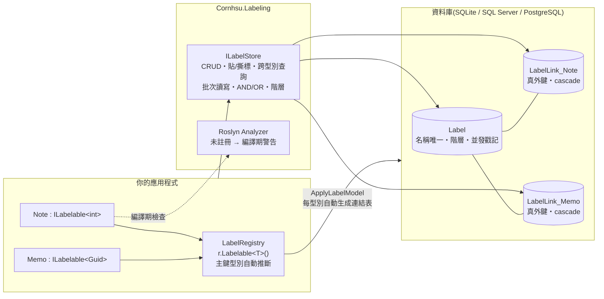

# Cornhsu.Labeling

[](https://www.nuget.org/packages/Cornhsu.Labeling)
[](https://www.nuget.org/packages/Cornhsu.Labeling.EntityFrameworkCore)
[](https://www.nuget.org/packages/Cornhsu.Labeling.EntityFrameworkCore)
[](https://github.com/HSU-YU-MING/cornhsu-labeling/actions/workflows/ci.yml)
[](LICENSE)

**[作品介紹與開發故事](https://cornhsu.com/cornhsu-labeling.html) · [NuGet](https://www.nuget.org/packages/Cornhsu.Labeling.EntityFrameworkCore) · MIT**

給 EF Core 的多型標籤系統。**同一個標籤,貼在任何型別上**——而且每條連結都有真外鍵。

測試涵蓋 SQLite / SQL Server / PostgreSQL × EF Core 8 / 9 / 10;
已在真實產品([QuillNest](https://cornhsu.com/quillnest.html))的正式資料上驗證。

## 架構一覽



## 為什麼需要它

EF Core 沒有內建多型關聯(polymorphic association)。「標籤 A 貼在實體 B 上」的 B 可能是 `Note`、`TodoItem`、`CalendarEvent`——它們是不同的表,所以每個人都得自己土法煉鋼一次。

**Before**(每加一個模組就要手工開一張 join table + 重寫一次查詢):

```csharp
public class NoteLabel     { public int NoteId; public int LabelId; }
public class TodoItemLabel { public int TodoItemId; public int LabelId; }
// ...第 N 個模組,第 N 張手工表,第 N 份重複的 Attach/Detach/Query 程式碼
```

**After**(一行註冊,表自動長出來,查詢統一走 `ILabelStore`):

```csharp
services.AddLabeling<AppDbContext>(r =>
{
    r.Labelable<Note>(n => n.Title);
    r.Labelable<TodoItem>(t => t.Content);
});
```

## 快速開始

```
dotnet add package Cornhsu.Labeling.EntityFrameworkCore
```

**1. 實體實作 `ILabelable<TKey>`**(不要求繼承任何基底類別;`int`、`Guid` 等主鍵都支援,可混用):

```csharp
public class Note : ILabelable<Guid>
{
    public Guid Id { get; set; }
    public string Title { get; set; } = "";
}

public class TodoItem : ILabelable<int>     // 既有專案的 int 流水號主鍵直接可用
{
    public int Id { get; set; }
    public string Content { get; set; } = "";
}
```

**2. 註冊**(主鍵型別自動推斷,不用寫第二個型別參數):

```csharp
services.AddDbContext<AppDbContext>(o => o.UseSqlite(cs));
services.AddLabeling<AppDbContext>(r =>
{
    r.Labelable<Note>(n => n.Title);
    r.Labelable<TodoItem>(t => t.Content);
});
```

**3. DbContext 一行掛上:**

```csharp
public class AppDbContext : DbContext
{
    private readonly LabelRegistry _registry;
    public AppDbContext(DbContextOptions<AppDbContext> options, LabelRegistry registry)
        : base(options) => _registry = registry;

    protected override void OnModelCreating(ModelBuilder b) => b.ApplyLabelModel(_registry);
}
```

**4. 用:**

```csharp
await store.AttachAsync(note, "論文", "急件");             // 標籤不存在會自動建立
var all   = await store.FindByLabelAsync("論文");          // 跨型別,IReadOnlyList<LabelHit>
var notes = await store.QueryByLabelAsync<Note>("論文");   // 強型別 IQueryable<Note>

// 多標籤 AND / OR:
var urgent = await store.FindByLabelsAsync(
    new[] { "論文", "急件" }, LabelMatch.All);             // 同時標了論文「和」急件
var either = await store.QueryByLabelsAsync<Note>(
    new[] { "論文", "急件" }, LabelMatch.Any);             // 標了論文「或」急件

// 清單畫面一次讀 50 筆的標籤(一次查詢,不是 50 次):
var labelsByNote = await store.GetLabelsOfManyAsync(visibleNotes);
foreach (var n in visibleNotes)
    Render(n, labelsByNote[n]);                            // 每個實體保證有項目(可能為空清單)

// 批次貼標(多選後「全部加上急件」;冪等、單次 SaveChanges):
await store.AttachManyAsync(selectedNotes, new[] { "急件" });

// 「策展式」標籤的 App(標籤帶顏色/圖示、由管理介面精心建立)可停用自動建立:
// r.AutoCreateLabels = false;   ← 註冊時設定
// 之後 AttachAsync 遇到不存在的標籤會拋出清楚的例外,而不是默默建一個裸標籤

// 跨型別命中的主鍵型別可能不同(Note 是 Guid、TodoItem 是 int),
// 所以 LabelHit.EntityId 是 object;需要強型別時:
var todoIds = all
    .Where(h => h.EntityClrType == typeof(TodoItem))
    .Select(h => h.EntityIdAs<int>());
```

完整可執行範例見 [samples/MinimalConsole](samples/MinimalConsole/Program.cs)。

## 使用 EF Core Migrations

`ApplyLabelModel` 會把 `Label` 與每個型別的 `LabelLink_*` 表加進你的 model,
所以 `dotnet ef migrations add` 會自動產生這些表(含完整外鍵),不需要額外設定。

但有一個必知的細節:因為 DbContext 的建構子需要 `LabelRegistry`,而 `dotnet ef`
在設計時期沒有 DI 容器,你必須提供一個 `IDesignTimeDbContextFactory`——
**這對非 ASP.NET 應用(WPF、主控台等)尤其重要**:

```csharp
public class DesignTimeFactory : IDesignTimeDbContextFactory<AppDbContext>
{
    public AppDbContext CreateDbContext(string[] args)
    {
        // 這裡註冊的型別必須與執行時期(AddLabeling)一致
        var registry = new LabelRegistry();
        registry.Labelable<Note>(n => n.Title);
        registry.Labelable<TodoItem>(t => t.Content);

        var options = new DbContextOptionsBuilder<AppDbContext>()
            .UseSqlite("DataSource=app.db")
            .Options;
        return new AppDbContext(options, registry);
    }
}
```

## 擴充 Label

`Label` 刻意精簡,只有「視覺識別」層級的欄位:`Name`、`Color`、`Icon`、階層與排序。
這是有意的邊界——**帶業務語意的欄位(標籤型別、模組/租戶隔離、權限…)套件不碰**,
因為它無法理解、也無法替你把關這些概念。

需要 app 專屬欄位時,用一張 **1:1 伴生表**指向 `Label.Id`,把套件的貼標能力與你的業務資料分開:

```csharp
// 你的伴生表:放套件不該懂的欄位
public class LabelMeta
{
    public Guid LabelId { get; set; }          // 1:1 指向 Cornhsu Label
    public Label Label { get; set; } = default!;
    public string LabelType { get; set; } = "標籤";   // 你的業務語意
    public string? AllowedModule { get; set; }
}

// 你自己的 DbContext 設定(與 ApplyLabelModel 並存)
b.Entity<LabelMeta>(e =>
{
    e.HasKey(x => x.LabelId);
    e.HasOne(x => x.Label).WithOne()
     .HasForeignKey<LabelMeta>(x => x.LabelId)
     .OnDelete(DeleteBehavior.Cascade);        // 標籤刪除時,附屬資料一起清掉
});
```

> 為什麼不用「繼承 Label」的方式?因為那會逼整個套件泛型化、也把侵入性帶回來——
> 就跟本套件在 §設計取捨 拒絕「要求實體繼承共同基底」是同一個理由。
> 精簡 + 伴生表,讓不需要擴充的使用者零負擔,需要的人也有乾淨的出路。

## 設計取捨

「標籤 A 貼在實體 B 上」要記在某張表,但 B 是不同的表。三條路:

### 方案 A:一張表通吃(discriminator column)

```
LabelLink(LabelId, EntityType TEXT, EntityId GUID)
```

| | |
|---|---|
| ✅ | 跨型別查詢一次 SQL 搞定 |
| ✅ | 新增模組零成本 |
| ❌ | **`EntityId` 無法建外鍵**——資料庫不知道它指向哪張表 |
| ❌ | 刪掉一則筆記,連結留下來變孤兒,只能靠應用層自己清 |
| ❌ | `EntityType` 存字串,重構改類別名稱就爆炸 |

### 方案 B:每型別一張 join table ← **選這個**

```
LabelLink_Note(LabelId → Label.Id, EntityId → Note.Id)
LabelLink_TodoItem(LabelId → Label.Id, EntityId → TodoItem.Id)
```

| | |
|---|---|
| ✅ | **真外鍵**,資料庫把關,cascade delete 自動清乾淨 |
| ✅ | 型別安全,重構不會壞 |
| ❌ | 跨型別查詢要合併 N 張表 |
| ❌ | 新增模組要新增表 ← **唯一痛點,而消除它就是本套件的價值** |

### 方案 C:所有實體繼承共同基底(TPH)

| | |
|---|---|
| ✅ | 模型最乾淨 |
| ❌ | **侵入性極高**,強迫使用者改既有繼承結構 |
| ❌ | C# 單一繼承——使用者的類別若已有基底類別,直接無解 |

### 決策與理由

**選 B。** 用泛型 `LabelLink<TEntity>` 讓 EF Core 為每個註冊型別自動產生一張表(EF Core 支援把封閉泛型型別當作獨立實體),把方案 B 唯一的痛點自動化掉。

> **拿到方案 B 的外鍵完整性,但不用付方案 B 的手工成本。**

跨型別查詢的效能代價是真的(N 個型別 = N 次查詢),但它是**可測量、可優化**的;而失去外鍵完整性是**不可逆的架構債**。用效能換正確性,划算。

另一個正規化紅利:標籤名稱只存一份,所有連結都用 `LabelId` 指向它,所以「重新命名標籤」是一次 O(1) 的 UPDATE,不需要任何 cascade。

## 編譯期防呆(Roslyn Analyzer)

套件內建 analyzer,安裝即生效,兩條規則:

| 規則 | 情境 | 為什麼 |
|---|---|---|
| `CHSU001` | 型別實作了 `ILabelable<TKey>`,但編譯單元內沒有 `r.Labelable<T>()` 註冊 | 執行期貼標/查詢會拋「型別未註冊」——把錯誤提前到編譯期 |
| `CHSU002` | 型別只實作了非泛型 `ILabelable`(marker) | 註冊時必因「無法推斷主鍵型別」拋例外 |

註冊發生在其他組件時 `CHSU001` 會誤報,請用 `#pragma warning disable CHSU001`
或 .editorconfig 對該型別靜音。

## 效能

樸素實測(SQLite 檔案資料庫、5 個註冊型別 × 10,000 筆實體、約 12 萬筆連結,
中位數,一般桌機;harness 見 [samples/Benchmark](samples/Benchmark/Program.cs)):

| 操作 | 中位數 |
|---|---|
| `FindByLabelAsync`(10% 命中 = 5,000 筆、跨 5 型別) | ~18 ms |
| `FindByLabelAsync`(0.1% 命中 = 50 筆) | ~1 ms |
| `FindByLabelAsync`(含子孫階層、500 筆) | ~2 ms |
| `QueryByLabelAsync<T>` + `CountAsync` | ~1 ms |
| 50 筆逐筆 `GetLabelsOfAsync`(N+1 反模式) | ~5 ms |
| `GetLabelsOfManyAsync`(50 筆一次查詢) | ~1 ms |
| `QueryByLabelsAsync<T>`(All / Any,2 標籤) | ~1.5 ms |

結論:跨型別查詢的「每型別一次查詢」樸素策略在此規模綽綽有餘,v1.0 不做查詢合併優化。
清單畫面請用 `GetLabelsOfManyAsync`,不要在迴圈裡呼叫 `GetLabelsOfAsync`
(本機 SQLite 差 5 倍;有網路延遲的資料庫差的是 49 次 roundtrip)。

## Limitations

- **實體主鍵支援 `int`/`long`/`Guid`/`string` 等具備相等運算子的型別,可在同一個 App 混用**;但 `Label` 本體的主鍵固定是 `Guid`(它是套件自有的表)。
- **`LabelHit.EntityId` 是 `object`**——跨型別查詢的命中可能來自不同主鍵型別,這是泛型主鍵的必要代價;用 `EntityIdAs<TKey>()` 取回強型別。
- **跨型別查詢是 N 次查詢**(N = 已註冊型別數)。樸素版先行,實測有瓶頸再優化成 `UNION ALL`。
- **`LabelRegistry` 必須全 App 單例。** EF Core 的 model cache 以 DbContext 型別為 key;同一個 DbContext 型別拿到不同 registry 會拿到錯的快取 model 且不會報錯。`AddLabeling` 已自動註冊為 Singleton。多租戶各自不同的可標記型別 v1 不支援(需自訂 `IModelCacheKeyFactory`)。
- **標籤名稱全域唯一,包含跨階層**——「工作/雜項」和「生活/雜項」不能各有一個叫「雜項」的子標籤。
  這是刻意取捨:整個 API 以名稱定址(`AttachAsync`、`FindByLabelAsync` 都吃名稱字串),
  一旦允許不同父層下同名,所有名稱定址的呼叫都會變成歧義。
  需要這種結構時,請把限定詞放進名稱本身(如「生活·雜項」)。
  未來若支援每父層唯一,勢必伴隨路徑定址(`"生活/雜項"`)的 API 改版,屬 v2 範疇。
- **標籤名稱會自動去除前後空白**(所有輸入入口一致);大小寫語意交由資料庫 collation 決定(SQLite 預設區分大小寫、SQL Server 預設不區分)。
- **get-or-create 標籤有競態**:兩條路徑同時建同名標籤會撞 unique index,以「重讀驗證後採用既有標籤」處理;若重讀發現不是同名競態,原例外照拋。
- **並發修改保護**:`Label.ConcurrencyStamp` 是並發戳記(每次透過 store 修改就輪換,不依賴資料庫功能,所有 provider 行為一致)。兩邊同時修改同一個標籤時,後存檔的一方會得到 `DbUpdateConcurrencyException` 而不是默默蓋掉對方——請接住這個例外,重讀後重試或提示使用者。
- **測試涵蓋 SQLite、SQL Server、PostgreSQL** 三個 provider(同一套測試,CI 每次都跑)。注意名稱大小寫語意隨 collation 而異:SQLite 預設區分大小寫、SQL Server 預設不區分。
- **`ILabelStore` 的寫入方法會呼叫你的 DbContext 的 `SaveChangesAsync`**——如果同一個 context 裡有其他未存檔的變更,會被一起送出。這是「與應用共用 DbContext」模式的固有取捨;若要隔離,請用獨立的 DbContext scope 呼叫 store。
- **只支援 EF Core 8+**。相依樓地板是 8.0.11(8.0 系列中已修補已知弱點通報的版本),消費端用 EF Core 9/10 會自動 unify。
- 測試請用 **SQLite in-memory,不要用 EF InMemory Provider**——後者不執行外鍵約束,測不到本套件的核心保證。

## 授權

MIT
