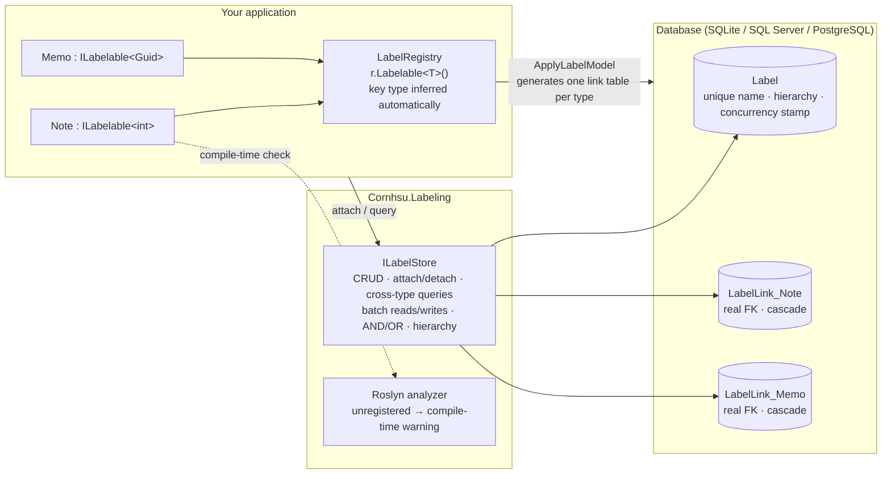

# Cornhsu.Labeling

[](https://www.nuget.org/packages/Cornhsu.Labeling)
[](https://www.nuget.org/packages/Cornhsu.Labeling.EntityFrameworkCore)
[](https://www.nuget.org/packages/Cornhsu.Labeling.EntityFrameworkCore)
[](https://github.com/HSU-YU-MING/cornhsu-labeling/actions/workflows/ci.yml)
[](LICENSE)

**[Project write-up](https://cornhsu.com/cornhsu-labeling) · [NuGet](https://www.nuget.org/packages/Cornhsu.Labeling.EntityFrameworkCore) · [繁體中文](README.zh-Hant.md) · MIT**

Polymorphic labeling for EF Core. **One label, attachable to any type** — with a real foreign
key behind every single link.

Tested across SQLite / SQL Server / PostgreSQL × EF Core 8 / 9 / 10, and validated on the
production data of a real product ([QuillNest](https://cornhsu.com/quillnest)).

## Architecture


```mermaid
flowchart LR
    subgraph app["Your application"]
        direction TB
        note["Note : ILabelable&lt;int&gt;"]
        memo["Memo : ILabelable&lt;Guid&gt;"]
        reg["LabelRegistry<br/>r.Labelable&lt;T&gt;()<br/>key type inferred automatically"]
    end

    subgraph pkg["Cornhsu.Labeling"]
        direction TB
        store["ILabelStore<br/>CRUD · attach/detach · cross-type queries<br/>batch reads/writes · AND/OR · hierarchy"]
        analyzer["Roslyn analyzer<br/>unregistered → compile-time warning"]
    end

    subgraph db["Database (SQLite / SQL Server / PostgreSQL)"]
        direction TB
        label[("Label<br/>unique name · hierarchy · concurrency stamp")]
        link1[("LabelLink_Note<br/>real FK · cascade")]
        link2[("LabelLink_Memo<br/>real FK · cascade")]
    end

    note -.->|"compile-time check"| analyzer
    note --> reg
    memo --> reg
    reg -->|"ApplyLabelModel<br/>generates one link table per type"| db
    app -->|"attach / query"| store
    store --> label
    store --> link1
    store --> link2
```

## Why it exists

EF Core has no built-in polymorphic association. In "label A is attached to entity B", B might be
a `Note`, a `TodoItem` or a `CalendarEvent` — different tables, so everyone ends up hand-rolling
the same thing once per project.

**Before** — every new module means another hand-written join table and another copy of the queries:

```csharp
public class NoteLabel     { public int NoteId; public int LabelId; }
public class TodoItemLabel { public int TodoItemId; public int LabelId; }
// ...Nth module, Nth hand-written table, Nth duplicated Attach/Detach/Query code
```

**After** — one line of registration, the tables appear on their own, and every query goes
through `ILabelStore`:

```csharp
services.AddLabeling<AppDbContext>(r =>
{
    r.Labelable<Note>(n => n.Title);
    r.Labelable<TodoItem>(t => t.Content);
});
```

## Quick start

```
dotnet add package Cornhsu.Labeling.EntityFrameworkCore
```

**1. Implement `ILabelable<TKey>` on your entities.** No base class is required, `int` and `Guid`
(and other key types) all work, and you can mix them freely:

```csharp
public class Note : ILabelable<Guid>
{
    public Guid Id { get; set; }
    public string Title { get; set; } = "";
}

public class TodoItem : ILabelable<int>     // an existing project's int identity key just works
{
    public int Id { get; set; }
    public string Content { get; set; } = "";
}
```

**2. Register.** The key type is inferred, so there is no second type parameter to write:

```csharp
services.AddDbContext<AppDbContext>(o => o.UseSqlite(cs));
services.AddLabeling<AppDbContext>(r =>
{
    r.Labelable<Note>(n => n.Title);
    r.Labelable<TodoItem>(t => t.Content);
});
```

**3. One line in your DbContext:**

```csharp
public class AppDbContext : DbContext
{
    private readonly LabelRegistry _registry;
    public AppDbContext(DbContextOptions<AppDbContext> options, LabelRegistry registry)
        : base(options) => _registry = registry;

    protected override void OnModelCreating(ModelBuilder b) => b.ApplyLabelModel(_registry);
}
```

**4. Use it:**

```csharp
await store.AttachAsync(note, "paper", "urgent");            // missing labels are created automatically
var all   = await store.FindByLabelAsync("paper");           // cross-type, IReadOnlyList<LabelHit>
var notes = await store.QueryByLabelAsync<Note>("paper");    // strongly typed IQueryable<Note>

// Multi-label AND / OR:
var urgent = await store.FindByLabelsAsync(
    new[] { "paper", "urgent" }, LabelMatch.All);            // tagged paper AND urgent
var either = await store.QueryByLabelsAsync<Note>(
    new[] { "paper", "urgent" }, LabelMatch.Any);            // tagged paper OR urgent

// Reading the labels of 50 rows for a list view (one query, not 50):
var labelsByNote = await store.GetLabelsOfManyAsync(visibleNotes);
foreach (var n in visibleNotes)
    Render(n, labelsByNote[n]);                              // every entity has an entry (possibly empty)

// Bulk attach ("select several, tag them all urgent"; idempotent, one SaveChanges):
await store.AttachManyAsync(selectedNotes, new[] { "urgent" });

// Apps with a curated label set (labels carry colors/icons, created via an admin screen)
// can turn auto-creation off:
// r.AutoCreateLabels = false;   ← set it at registration
// AttachAsync then throws a clear exception for an unknown label instead of quietly
// creating a bare one.

// Cross-type hits can have different key types (Note uses Guid, TodoItem uses int),
// which is why LabelHit.EntityId is object. To get it typed:
var todoIds = all
    .Where(h => h.EntityClrType == typeof(TodoItem))
    .Select(h => h.EntityIdAs<int>());
```

A complete runnable example lives in [samples/MinimalConsole](samples/MinimalConsole/Program.cs).

## Using EF Core migrations

`ApplyLabelModel` adds `Label` and one `LabelLink_*` table per type to your model, so
`dotnet ef migrations add` generates them (with full foreign keys) without any extra setup.

There is one detail worth knowing: because your DbContext's constructor needs a `LabelRegistry`
and `dotnet ef` has no DI container at design time, you must supply an
`IDesignTimeDbContextFactory`. **This matters especially for non-ASP.NET applications** (WPF,
console, and so on):

```csharp
public class DesignTimeFactory : IDesignTimeDbContextFactory<AppDbContext>
{
    public AppDbContext CreateDbContext(string[] args)
    {
        // The types registered here must match the runtime registration in AddLabeling
        var registry = new LabelRegistry();
        registry.Labelable<Note>(n => n.Title);
        registry.Labelable<TodoItem>(t => t.Content);

        var options = new DbContextOptionsBuilder<AppDbContext>()
            .UseSqlite("DataSource=app.db")
            .Options;
        return new AppDbContext(options, registry);
    }
}
```

## Extending Label

`Label` is deliberately minimal: only visual-identity fields (`Name`, `Color`, `Icon`, hierarchy
and ordering). That boundary is intentional — **fields carrying business meaning (label type,
module or tenant isolation, permissions…) are not the package's business**, because it cannot
understand them and cannot enforce them on your behalf.

When you need app-specific fields, use a **1:1 companion table** keyed on `Label.Id`, which keeps
the package's labeling capability separate from your business data:

```csharp
// Your companion table: the fields the package should not know about
public class LabelMeta
{
    public Guid LabelId { get; set; }          // 1:1 with the Cornhsu Label
    public Label Label { get; set; } = default!;
    public string LabelType { get; set; } = "tag";   // your business semantics
    public string? AllowedModule { get; set; }
}

// Your own DbContext configuration, alongside ApplyLabelModel
b.Entity<LabelMeta>(e =>
{
    e.HasKey(x => x.LabelId);
    e.HasOne(x => x.Label).WithOne()
     .HasForeignKey<LabelMeta>(x => x.LabelId)
     .OnDelete(DeleteBehavior.Cascade);        // deleting a label cleans up its metadata
});
```

> Why not "inherit from Label" instead? Because that forces the entire package to become generic
> and brings the invasiveness right back — the same reason the design trade-offs below reject
> "require your entities to share a base class". Minimal core plus a companion table costs nothing
> for people who do not need to extend, and leaves a clean path for people who do.

## Design trade-offs

"Label A is attached to entity B" has to be recorded in some table, but B is many different
tables. Three options:

### Option A: one table for everything (discriminator column)

```
LabelLink(LabelId, EntityType TEXT, EntityId GUID)
```

| | |
|---|---|
| ✅ | Cross-type queries are a single SQL statement |
| ✅ | Adding a module costs nothing |
| ❌ | **`EntityId` cannot have a foreign key** — the database has no idea which table it points at |
| ❌ | Delete a note and the link stays behind as an orphan; only application code can clean it up |
| ❌ | `EntityType` is a string, so renaming a class during a refactor breaks the data |

### Option B: one join table per type ← **this one**

```
LabelLink_Note(LabelId → Label.Id, EntityId → Note.Id)
LabelLink_TodoItem(LabelId → Label.Id, EntityId → TodoItem.Id)
```

| | |
|---|---|
| ✅ | **Real foreign keys**: the database enforces integrity and cascade delete cleans up automatically |
| ✅ | Type-safe; refactoring cannot break it |
| ❌ | A cross-type query has to union N tables |
| ❌ | A new module means a new table ← **the only pain point, and removing it is this package's whole value** |

### Option C: all entities inherit a shared base (TPH)

| | |
|---|---|
| ✅ | The cleanest model |
| ❌ | **Extremely invasive**: it forces users to change their existing inheritance |
| ❌ | C# has single inheritance — if your class already has a base class, there is simply no way out |

### The decision, and why

**Option B.** A generic `LabelLink<TEntity>` lets EF Core generate one table per registered type
(EF Core treats a closed generic type as its own entity), which automates away Option B's only
pain point.

> **You get Option B's referential integrity without paying Option B's manual cost.**

The performance cost of cross-type queries is real (N types = N queries), but it is
**measurable and optimizable**; losing referential integrity is **irreversible architectural
debt**. Trading performance for correctness is a good deal.

One more normalization dividend: a label's name is stored exactly once and every link points at
it by `LabelId`, so renaming a label is a single O(1) UPDATE with no cascade at all.

## Compile-time safety net (Roslyn analyzer)

The package ships an analyzer — installing it is all it takes. Two rules:

| Rule | When it fires | Why |
|---|---|---|
| `CHSU001` | A type implements `ILabelable<TKey>` but this compilation has no `r.Labelable<T>()` for it | Attaching or querying it at run time would throw "type is not registered" — this moves the error to compile time |
| `CHSU002` | A type implements only the non-generic `ILabelable` marker | Registration is guaranteed to throw, because the key type cannot be inferred |

Full details, examples and fixes: [docs/analyzer-rules.md](docs/analyzer-rules.md).

`CHSU001` is a false positive when the registration lives in another assembly — silence it with
`#pragma warning disable CHSU001` or an `.editorconfig` entry for that type.

## Performance

A naive benchmark (SQLite file database, 5 registered types × 10,000 entities, roughly 120,000
links, medians on an ordinary desktop; the harness is in
[samples/Benchmark](samples/Benchmark/Program.cs)):

| Operation | Median |
|---|---|
| `FindByLabelAsync` (10% hit rate = 5,000 rows across 5 types) | ~18 ms |
| `FindByLabelAsync` (0.1% hit rate = 50 rows) | ~1 ms |
| `FindByLabelAsync` (including descendants, 500 rows) | ~2 ms |
| `QueryByLabelAsync<T>` + `CountAsync` | ~1 ms |
| 50 individual `GetLabelsOfAsync` calls (the N+1 anti-pattern) | ~5 ms |
| `GetLabelsOfManyAsync` (50 rows in one query) | ~1 ms |
| `QueryByLabelsAsync<T>` (All / Any, 2 labels) | ~1.5 ms |

Conclusion: the naive "one query per type" strategy for cross-type queries is more than adequate
at this scale, so v1.0 does not merge queries. For list views use `GetLabelsOfManyAsync` rather
than calling `GetLabelsOfAsync` in a loop — it is 5× faster on local SQLite, and on a database
with network latency the difference is 49 round trips.

## Limitations

- **Entity keys may be `int`/`long`/`Guid`/`string` or any type with equality, and you may mix
  them within one application**; `Label`'s own key is always a `Guid` (it is the package's table).
- **`LabelHit.EntityId` is an `object`** — a cross-type query can return hits with different key
  types, which is the unavoidable cost of generic keys. Use `EntityIdAs<TKey>()` to get it typed.
- **A cross-type query is N queries** (N = number of registered types). The naive version ships
  first; it will be optimized into a `UNION ALL` if measurement ever shows a bottleneck.
- **`LabelRegistry` must be an application-wide singleton.** EF Core's model cache is keyed by
  DbContext type, so handing the same DbContext type a different registry gives you a wrongly
  cached model — silently, with no error. `AddLabeling` already registers it as a Singleton.
  Multi-tenant setups where each tenant has different labelable types are not supported in v1
  (that needs a custom `IModelCacheKeyFactory`).
- **Label names are globally unique, including across the hierarchy** — "Work/Misc" and
  "Life/Misc" cannot both have a child named "Misc". This is a deliberate trade-off: the entire
  API addresses labels by name (`AttachAsync` and `FindByLabelAsync` both take name strings), and
  allowing duplicates under different parents would make every name-addressed call ambiguous.
  When you need that structure, put the qualifier in the name itself (e.g. "Life · Misc").
  Supporting per-parent uniqueness in future would necessarily come with a path-addressing API
  (`"Life/Misc"`), which is v2 territory.
- **Label names are trimmed of surrounding whitespace** (consistently, at every entry point).
  Case sensitivity is left to the database collation — SQLite is case-sensitive by default,
  SQL Server is not.
- **Get-or-create has a race**: two paths creating the same name concurrently will collide on the
  unique index, which is handled by re-reading and adopting the existing label. If the re-read
  shows it was not a same-name race, the original exception propagates.
- **Concurrent modification protection**: `Label.ConcurrencyStamp` is a concurrency token, rotated
  on every modification through the store. It does not rely on any database feature, so behaviour
  is identical across providers. When two callers modify the same label, the one that saves second
  gets a `DbUpdateConcurrencyException` instead of silently overwriting — catch it, then re-read
  and retry or prompt the user.
- **Tested against SQLite, SQL Server and PostgreSQL** (the same test suite, on every CI run).
  Note that name case semantics vary with collation, as described above.
- **`ILabelStore`'s write methods call your DbContext's `SaveChangesAsync`** — any other pending
  changes in that same context get committed along with them. That is the inherent trade-off of
  sharing a DbContext with the application; if you need isolation, call the store from a separate
  DbContext scope.
- **EF Core 8+ only.** The dependency floor is 8.0.11 (the 8.0-series version with known
  vulnerability advisories patched); consumers on EF Core 9 or 10 unify automatically.
- For tests, use **SQLite in-memory rather than the EF InMemory provider** — the latter does not
  enforce foreign keys, so it cannot test this package's central guarantee.

## License

MIT
